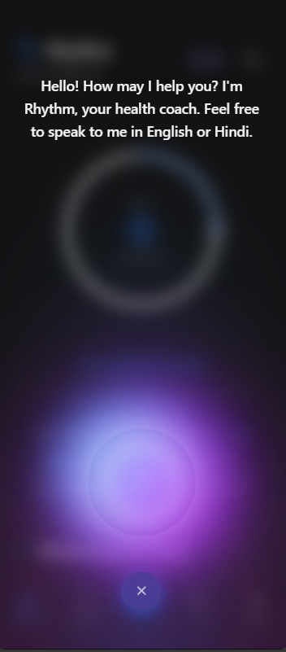
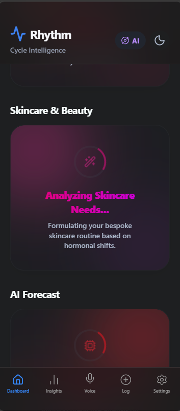
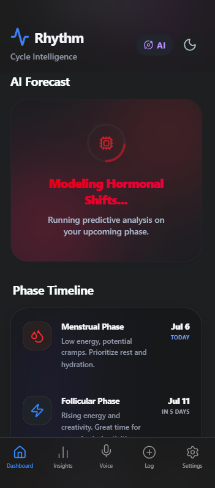
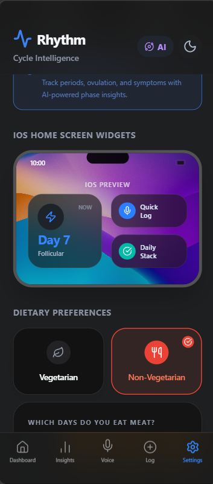
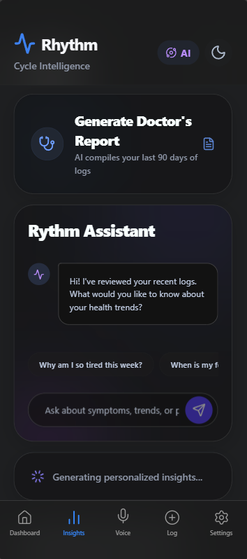
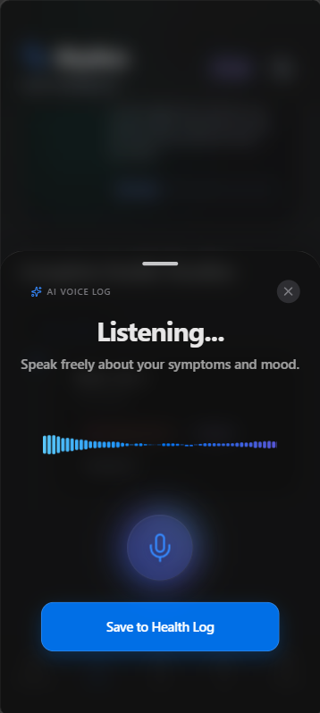

<div align="center">
  
  <h1>🌸 Google Rhythm 🌸</h1>
  <p><b>An AI-powered, privacy-first women's health Concierge Agent.</b></p>
  <h3><a href="https://project-1rhgc.vercel.app/">🔴 Try the Live Interactive Demo Here</a></h3>
  
  [](https://www.kaggle.com)
  [](https://react.dev/)
  [](https://deepmind.google/technologies/gemini/)
  [](https://ai.meta.com/llama/)
  [](https://creativecommons.org/licenses/by/4.0/)
</div>

<br />

> Built for the **Kaggle AI Agents: Intensive Vibe Coding Capstone Project**. Submitted under the **Concierge Agents** track. Google Rhythm is an autonomous health companion that deeply understands a user's lifecycle stage and proactively manages their health journey without ever compromising their data privacy.

---

## 📸 Application Gallery

| Dashboard & Tracking | Agentic Voice Logging |
| :---: | :---: |
|  |  |
| **Personalized Onboarding** | **AI Clinical Insights** |
|  |  |
| **Privacy & Settings** | **Custom Modes** |
|  |  |

---

## 🛑 The Problem
Women’s health tracking is fundamentally broken on two fronts: **Privacy** and **Personalization**. 
1. **The Privacy Crisis:** Major period tracking applications have faced massive FTC fines for secretly sharing highly sensitive medical data with third-party advertisers. Users are forced to choose between managing their personal health and surrendering their intimate data to the cloud. 
2. **The Personalization Deficit:** Existing apps rely on rigid calendar-math averages (the "28-day myth") and serve generic, static tips. They fail to adapt to the complex, non-linear realities of the human body, especially for those navigating conditions like PCOS, Endometriosis, or changing life stages.

## 💡 The Solution (Why Agents?)
Google Rhythm solves this by utilizing **AI Agents** as a localized "Concierge". Traditional, deterministic software cannot adapt to the dynamic nuances of human health, but AI Agents uniquely solve this by continuously reasoning over multi-modal inputs.
* 🔒 **100% Privacy by Design:** The app runs an offline-first architecture using IndexedDB. User data is encrypted locally, and zero health data is ever sold, shared, or accessible to us.
* 🎙️ **Agentic Voice Logging:** Instead of clicking through menus, users can simply talk to Google Rhythm. Our agentic system parses unstructured, spoken audio into structured clinical data (symptoms, severity, mood) and logs it directly to the local database.
* 🧠 **Predictive Health Forecasting:** Using our background agent skills, the app reasons over the past 3 days of logs to predict upcoming symptoms and autonomously generates highly contextualized guidance.

---

## ✨ Key Features
* **Multi-Stage Lifecycle Modes:** Adapts the entire UI and prediction math for Cycle, Try to Conceive, Pregnancy, Perimenopause, and Childfree journeys.
* **Strict Medication Alarms:** Background Service Workers manage critical, time-sensitive alerts (like birth control) mimicking OS-level functionality.
* **Google Ecosystem Integrations:** Anonymous Firebase auth, Google Drive encrypted backups, and Google Calendar sync.
* **Vibe Coded via Antigravity:** Developed utilizing multiple autonomous agents to iterate rapidly on architecture, UI, and security paradigms.

---

## 🏗️ Agentic Architecture
Google Rhythm is built using a modern, serverless web stack designed for rapid deployment, high performance, and maximum security. 

### The Multi-Agent System
1. **The Clinical Extraction Agent (Llama 3.1 70B):** Voice logs are routed to Deepgram/Groq for transcription, then passed to Llama 3.1 with a strict system prompt to perform clinical extraction, flagging severe symptoms and returning structured JSON.
2. **The Cycle Engine & Pattern Reasoner (Gemini 2.0 Flash):** An agent skill that evaluates daily states against historical IndexedDB logs. It calculates cycle phases proportionally and triggers Gemini to generate a personalized "Daily Insight".
3. **The Autonomous Alert Manager:** A Service Worker agent that monitors medication schedules and triggers aggressive OS-level push notifications.

### Security Features
To protect API keys and user privacy, all LLM reasoning occurs through a secure **Vercel Serverless Proxy** (`/api/llm.js`). The client-side application contains absolutely zero API keys.

---

## 🛠️ Instructions for Setup
To run this project locally and reproduce the agentic features, follow these steps:

### 1. Prerequisites
* Node.js (v18 or higher recommended)
* Obtain your API Keys for full AI functionality:
  * Gemini API Key
  * NVIDIA NIM API Key (Optional for Llama 3.1 extraction)
  * Groq API Key (Optional for high-speed STT)

### 2. Installation
Clone the repository and install dependencies:
```bash
git clone https://github.com/sonusp/rhythm-capstone.git
cd rhythm-capstone/google-rhythm
npm install
```

### 3. Environment Variables
Copy the example environment file and populate it with your keys:
```bash
cp .env.example .env.local
```
*(Open `.env.local` in your editor and paste your API keys. Note: Due to our secure architecture, browser-exposed keys are limited. Secure keys are strictly used by the Vercel API functions.)*

### 4. Running the Development Server
Start the Vite frontend and the Vercel API proxy:
```bash
npm run dev
```
Open `http://localhost:5173` in your browser.

---

## 📜 License
This project is licensed under the **CC-BY 4.0 License** as per the Kaggle Capstone Competition rules. See the `LICENSE` file for details.
