# 🔬 Google Rhythm — Full Codebase Scan Report

> **Scanned:** 66+ files across 4 domains | **Date:** June 29, 2026

---

## 📋 Project Overview

**Google Rhythm** is a **privacy-first menstrual cycle tracking PWA** built with React 19 + Vite 6, featuring AI-powered insights, voice logging, zero-knowledge encryption, and offline-first architecture.

| Attribute | Value |
|---|---|
| **Framework** | React 19 + Vite 8 (SPA) |
| **State Mgmt** | Zustand v5 (persisted to localStorage) |
| **Local DB** | Dexie.js (IndexedDB) |
| **Cloud Sync** | Firebase Firestore (encrypted) |
| **AI Backends** | Google Gemini 2.0 Flash + NVIDIA NIM |
| **Voice** | Deepgram STT |
| **Styling** | Tailwind CSS v4 + Framer Motion |
| **Charts** | Recharts |
| **Hosting** | Vercel (serverless functions) |
| **PWA** | Service worker (vite-plugin-pwa + Workbox), manifest, offline-first |
| **Encryption** | AES-256-GCM (Web Crypto API, PBKDF2 600k iterations) + dexie-encrypted (IndexedDB at-rest) |
| **LLM Waterfall** | NVIDIA NIM → Groq → OpenRouter (automatic failover) |

---

## 🗂️ Architecture Map

```mermaid
graph TB
    subgraph Client["🖥️ Client (React SPA)"]
        App["App.jsx (Root)"]
        subgraph Views["Core Views"]
            Dashboard["DashboardView"]
            Log["LogView"]
            Insights["InsightsView"]
            Profile["ProfileView"]
            Settings["SettingsView"]
        end
        subgraph Special["Specialized"]
            Pregnancy["PregnancyDashboard"]
            Peri["PerimenopauseDashboard"]
            Partner["PartnerDashboard"]
            Import["DataImportView"]
        end
        subgraph AI["AI Features"]
            Assistant["RhythmAssistant"]
            Voice["VoiceRecorder"]
            DocReport["DoctorReportModal"]
        end
        subgraph Onboard["Onboarding"]
            Welcome["WelcomeScreen"]
            Tutorial["TutorialCarousel"]
            Wizard["OnboardingWizard"]
        end
    end

    subgraph Services["⚙️ Service Layer"]
        CycleEngine["cycleEngine.js"]
        PatternEngine["patternEngine.js"]
        GeminiSvc["geminiService.js"]
        NIMSvc["nimService.js"]
        DeepgramSvc["deepgramService.js"]
        DB["db.js (Dexie)"]
        Crypto["crypto.js"]
        Firestore["firestore.js"]
        Notify["notificationService.js"]
        AlertMgr["cycleAlertManager.js"]
        Calendar["calendarService.js"]
        Drive["driveService.js"]
    end

    subgraph Backend["☁️ Backend (Vercel Serverless)"]
        APIGemini["/api/gemini"]
        APILLM["/api/llm"]
        APITranscribe["/api/transcribe"]
        APIToken["/api/deepgram-token"]
        APINudge["/api/send-nudge"]
    end

    subgraph External["🌐 External"]
        CF["Cloudflare Worker"]
        GeminiAPI["Gemini API"]
        NIMAPI["NIM API"]
        DeepgramAPI["Deepgram API"]
        FirebaseCloud["Firebase/Firestore"]
        GoogleCal["Google Calendar API"]
        GoogleDrive["Google Drive API"]
    end

    App --> Views
    App --> Special
    App --> AI
    App --> Onboard

    Dashboard --> CycleEngine
    Dashboard --> GeminiSvc
    Insights --> PatternEngine
    Insights --> GeminiSvc
    Assistant --> GeminiSvc
    Assistant --> NIMSvc
    Voice --> DeepgramSvc
    DocReport --> GeminiSvc

    GeminiSvc --> APIGemini --> GeminiAPI
    NIMSvc --> APILLM --> NIMAPI
    DeepgramSvc --> APITranscribe --> DeepgramAPI
    DeepgramSvc --> APIToken
    Notify --> APINudge

    DB --> Crypto --> Firestore --> FirebaseCloud
    Calendar --> GoogleCal
    Drive --> GoogleDrive
    CF --> DeepgramAPI
```

---

## 📁 File Inventory (66 files)

### Config & Build (8 files)
| File | Size | Purpose |
|---|---|---|
| [package.json](file:///E:/My Projects/Google Rythm Project/google-rhythm/package.json) | 1.3KB | Dependencies & scripts |
| [vite.config.js](file:///E:/My Projects/Google Rythm Project/google-rhythm/vite.config.js) | 2.4KB | Build config, PWA copy, polyfills |
| [vercel.json](file:///E:/My Projects/Google Rythm Project/google-rhythm/vercel.json) | 531B | Serverless routing & security headers |
| [tailwind.config.js](file:///E:/My Projects/Google Rythm Project/google-rhythm/tailwind.config.js) | 319B | Tailwind v4 config |
| [eslint.config.js](file:///E:/My Projects/Google Rythm Project/google-rhythm/eslint.config.js) | 568B | Linting rules |
| [playwright.config.js](file:///E:/My Projects/Google Rythm Project/google-rhythm/playwright.config.js) | 699B | E2E test config |
| [postcss.config.js](file:///E:/My Projects/Google Rythm Project/google-rhythm/postcss.config.js) | 91B | PostCSS config |
| [.gitignore](file:///E:/My Projects/Google Rythm Project/google-rhythm/.gitignore) | 271B | Git exclusions |

### Entry Points (3 files)
| File | Size | Purpose |
|---|---|---|
| [index.html](file:///E:/My Projects/Google Rythm Project/google-rhythm/index.html) | 1.1KB | HTML shell, SW registration |
| [main.jsx](file:///E:/My Projects/Google Rythm Project/google-rhythm/src/main.jsx) | 915B | React mount + SW lifecycle |
| [App.jsx](file:///E:/My Projects/Google Rythm Project/google-rhythm/src/App.jsx) | 17.5KB | Root component, tab navigation |

### UI Components (17 files)
| File | Size | Purpose |
|---|---|---|
| [SettingsView.jsx](file:///E:/My Projects/Google Rythm Project/google-rhythm/src/components/SettingsView.jsx) | **70.7KB** | App settings (largest file) |
| [OnboardingWizard.jsx](file:///E:/My Projects/Google Rythm Project/google-rhythm/src/components/OnboardingWizard.jsx) | **59.8KB** | Multi-step onboarding |
| [DashboardView.jsx](file:///E:/My Projects/Google Rythm Project/google-rhythm/src/components/DashboardView.jsx) | **59.5KB** | Main dashboard |
| [InsightsView.jsx](file:///E:/My Projects/Google Rythm Project/google-rhythm/src/components/InsightsView.jsx) | **57.1KB** | AI analytics views |
| [LogView.jsx](file:///E:/My Projects/Google Rythm Project/google-rhythm/src/components/LogView.jsx) | 31.8KB | Daily logging |
| [DataImportView.jsx](file:///E:/My Projects/Google Rythm Project/google-rhythm/src/components/DataImportView.jsx) | 26.4KB | Data import from other apps |
| [PregnancyDashboard.jsx](file:///E:/My Projects/Google Rythm Project/google-rhythm/src/components/PregnancyDashboard.jsx) | 24.2KB | Pregnancy tracking |
| [RhythmAssistant.jsx](file:///E:/My Projects/Google Rythm Project/google-rhythm/src/components/RhythmAssistant.jsx) | 18.1KB | AI chat assistant |
| [ProfileView.jsx](file:///E:/My Projects/Google Rythm Project/google-rhythm/src/components/ProfileView.jsx) | 16.1KB | User profile |
| [PerimenopauseDashboard.jsx](file:///E:/My Projects/Google Rythm Project/google-rhythm/src/components/PerimenopauseDashboard.jsx) | 15.9KB | Perimenopause tracking |
| [DoctorReportModal.jsx](file:///E:/My Projects/Google Rythm Project/google-rhythm/src/components/DoctorReportModal.jsx) | 10.8KB | AI doctor report |
| [VoiceRecorder.jsx](file:///E:/My Projects/Google Rythm Project/google-rhythm/src/components/VoiceRecorder.jsx) | 10.1KB | Voice symptom logging |
| [PartnerConfigModal.jsx](file:///E:/My Projects/Google Rythm Project/google-rhythm/src/components/PartnerConfigModal.jsx) | 8.8KB | Partner access config |
| [PartnerDashboard.jsx](file:///E:/My Projects/Google Rythm Project/google-rhythm/src/components/PartnerDashboard.jsx) | 7KB | Partner view |
| [WelcomeScreen.jsx](file:///E:/My Projects/Google Rythm Project/google-rhythm/src/components/WelcomeScreen.jsx) | 6.6KB | Welcome experience |
| [LockScreen.jsx](file:///E:/My Projects/Google Rythm Project/google-rhythm/src/components/LockScreen.jsx) | 6.6KB | PIN/biometric lock |
| [TutorialCarousel.jsx](file:///E:/My Projects/Google Rythm Project/google-rhythm/src/components/TutorialCarousel.jsx) | 3.9KB | Tutorial slides |

### Services (12 files)
| File | Size | Purpose |
|---|---|---|
| [cycleEngine.js](file:///E:/My Projects/Google Rythm Project/google-rhythm/src/services/cycleEngine.js) | **29.5KB** | Cycle prediction algorithms |
| [nimService.js](file:///E:/My Projects/Google Rythm Project/google-rhythm/src/services/nimService.js) | 21.2KB | NVIDIA NIM LLM integration |
| [geminiService.js](file:///E:/My Projects/Google Rythm Project/google-rhythm/src/services/geminiService.js) | 14.1KB | Google Gemini AI integration |
| [cycleAlertManager.js](file:///E:/My Projects/Google Rythm Project/google-rhythm/src/services/cycleAlertManager.js) | 13KB | Alert scheduling logic |
| [notificationService.js](file:///E:/My Projects/Google Rythm Project/google-rhythm/src/services/notificationService.js) | 9.2KB | Push notifications |
| [db.js](file:///E:/My Projects/Google Rythm Project/google-rhythm/src/services/db.js) | 9.5KB | IndexedDB via Dexie |
| [firestore.js](file:///E:/My Projects/Google Rythm Project/google-rhythm/src/services/firestore.js) | 3.5KB | Cloud sync layer |
| [crypto.js](file:///E:/My Projects/Google Rythm Project/google-rhythm/src/services/crypto.js) | 3.3KB | TweetNaCl encryption |
| [calendarService.js](file:///E:/My Projects/Google Rythm Project/google-rhythm/src/services/calendarService.js) | 2.8KB | Google Calendar API |
| [driveService.js](file:///E:/My Projects/Google Rythm Project/google-rhythm/src/services/driveService.js) | 2.5KB | Google Drive backup |
| [deepgramService.js](file:///E:/My Projects/Google Rythm Project/google-rhythm/src/services/deepgramService.js) | 1.1KB | Deepgram STT client |
| [firebase.js](file:///E:/My Projects/Google Rythm Project/google-rhythm/src/services/firebase.js) | 550B | Firebase init |

### State & Utils (3 files)
| File | Size | Purpose |
|---|---|---|
| [patternEngine.js](file:///E:/My Projects/Google Rythm Project/google-rhythm/src/utils/patternEngine.js) | 15.5KB | Statistical pattern analysis |
| [useAppStore.js](file:///E:/My Projects/Google Rythm Project/google-rhythm/src/store/useAppStore.js) | 8.9KB | Zustand global store |
| [constants.js](file:///E:/My Projects/Google Rythm Project/google-rhythm/src/utils/constants.js) | 1.6KB | App constants |
| [useAutoSync.js](file:///E:/My Projects/Google Rythm Project/google-rhythm/src/hooks/useAutoSync.js) | 4KB | Auto cloud sync hook |

### API Endpoints (5 files)
| File | Size | Purpose |
|---|---|---|
| [api/transcribe.js](file:///E:/My Projects/Google Rythm Project/google-rhythm/api/transcribe.js) | 4.9KB | Audio transcription proxy |
| [api/llm.js](file:///E:/My Projects/Google Rythm Project/google-rhythm/api/llm.js) | 3.7KB | NIM LLM proxy |
| [api/send-nudge.js](file:///E:/My Projects/Google Rythm Project/google-rhythm/api/send-nudge.js) | 3.1KB | Push notification sender |
| [api/gemini.js](file:///E:/My Projects/Google Rythm Project/google-rhythm/api/gemini.js) | 2.5KB | Gemini API proxy |
| [api/deepgram-token.js](file:///E:/My Projects/Google Rythm Project/google-rhythm/api/deepgram-token.js) | 1.5KB | Short-lived token generator |

### Cloudflare Proxy (3 files)
| File | Size | Purpose |
|---|---|---|
| [index.js](file:///E:/My Projects/Google Rythm Project/cloudflare-proxy/src/index.js) | 1.7KB | WebSocket/HTTP proxy worker |
| [wrangler.toml](file:///E:/My Projects/Google Rythm Project/cloudflare-proxy/wrangler.toml) | 154B | Worker config |
| [test.js](file:///E:/My Projects/Google Rythm Project/cloudflare-proxy/test.js) | 507B | Smoke test |

### PWA (2 files)
| File | Size | Purpose |
|---|---|---|
| [sw.js](file:///E:/My Projects/Google Rythm Project/google-rhythm/public/sw.js) | 5.3KB | Service worker |
| [manifest.json](file:///E:/My Projects/Google Rythm Project/google-rhythm/public/manifest.json) | 526B | PWA manifest |

### Styles (2 files)
| File | Size | Purpose |
|---|---|---|
| [index.css](file:///E:/My Projects/Google Rythm Project/google-rhythm/src/index.css) | 2.8KB | Global styles, dark theme |
| [App.css](file:///E:/My Projects/Google Rythm Project/google-rhythm/src/App.css) | 2.8KB | App-specific styles |

### Tests (2 files)
| File | Size | Purpose |
|---|---|---|
| [app.spec.js](file:///E:/My Projects/Google Rythm Project/google-rhythm/src/tests/app.spec.js) | 8.8KB | Playwright E2E tests |
| [minimal.spec.js](file:///E:/My Projects/Google Rythm Project/google-rhythm/src/tests/minimal.spec.js) | 336B | Minimal smoke test |

### Documentation (13 files)
| File | Purpose |
|---|---|
| [README.md](file:///E:/My Projects/Google Rythm Project/google-rhythm/README.md) | Project overview |
| [Features.md](file:///E:/My Projects/Google Rythm Project/google-rhythm/Features.md) | Feature descriptions |
| [Progress.md](file:///E:/My Projects/Google Rythm Project/Progress.md) | Development timeline |
| [.env.example](file:///E:/My Projects/Google Rythm Project/google-rhythm/.env.example) | Environment vars template |
| [cloudflare_worker_proxy.md](file:///E:/My Projects/Google Rythm Project/docs/cloudflare_worker_proxy.md) | Cloudflare proxy docs |
| [deepgram_agent_api_security_report.md](file:///E:/My Projects/Google Rythm Project/docs/deepgram_agent_api_security_report.md) | Security audit |
| [1_PRD.md](file:///E:/My Projects/Google Rythm Project/Product Specification Documents/1_PRD.md) | Product Requirements |
| [2_SRD.md](file:///E:/My Projects/Google Rythm Project/Product Specification Documents/2_SRD.md) | Software Requirements |
| [3_TRD.md](file:///E:/My Projects/Google Rythm Project/Product Specification Documents/3_TRD.md) | Technical Requirements |
| [4_Backend_Schema.md](file:///E:/My Projects/Google Rythm Project/Product Specification Documents/4_Backend_Schema.md) | Database Schema |
| [5_App_Flow.md](file:///E:/My Projects/Google Rythm Project/Product Specification Documents/5_App_Flow.md) | Application Flow |
| [6_Implementation_Plan.md](file:///E:/My Projects/Google Rythm Project/Product Specification Documents/6_Implementation_Plan.md) | Implementation Plan |
| [7_Competitive_Analysis.md](file:///E:/My Projects/Google Rythm Project/Product Specification Documents/7_Competitive_Analysis.md) | Competitor Analysis |

---

## ✅ Strengths

| # | Strength | Details |
|---|---|---|
| 1 | **Zero-Knowledge Encryption** | All cloud-synced data is encrypted client-side with TweetNaCl before leaving the device |
| 2 | **API Key Security** | All external API keys are server-side via Vercel serverless functions — never exposed to client |
| 3 | **Offline-First Architecture** | IndexedDB (Dexie) as primary store; app works fully offline |
| 4 | **Feature Completeness** | Pregnancy, perimenopause, partner mode, voice input, AI assistant, data import, doctor reports |
| 5 | **Dual AI Strategy** | Both Gemini and NIM available as LLM backends |
| 6 | **Strong PWA** | Service worker with proper caching, push notifications, installable |
| 7 | **Privacy Design** | Lock screen, partner privacy filtering, encrypted backups |
| 8 | **Sophisticated Predictions** | Cycle engine with condition-specific adjustments (PCOS, endometriosis) |
| 9 | **Comprehensive Specs** | Full PRD/SRD/TRD documentation suite |
| 10 | **Google Integrations** | Calendar sync, Drive backup, Firebase auth |

---

## ⚠️ Issues & Concerns

### 🔴 Critical

| # | Issue | Location | Risk |
|---|---|---|---|
| 1 | **Hardcoded Google OAuth Client ID** | [main.jsx:13](file:///E:/My Projects/Google Rythm Project/google-rhythm/src/main.jsx#L13) | OAuth client ID hardcoded in source — violates Zero-Trust rule from `AGENTS.md` |
| 2 | **Deepgram API Key exposed client-side** | [deepgramService.js](file:///E:/My Projects/Google Rythm Project/google-rhythm/src/services/deepgramService.js) | `VITE_DEEPGRAM_API_KEY` bundled into client JS, direct API calls to Deepgram with key in `Authorization` header — must be proxied |
| 3 | **OAuth token in localStorage** | [useAppStore.js:247](file:///E:/My Projects/Google Rythm Project/google-rhythm/src/store/useAppStore.js#L247) | `googleAccessToken` persisted to localStorage — vulnerable to XSS attacks |
| 4 | **PINs stored in plaintext** | [useAppStore.js](file:///E:/My Projects/Google Rythm Project/google-rhythm/src/store/useAppStore.js) | `lockPin` and `syncPin` stored as plaintext in localStorage via Zustand persist |
| 5 | **Vault key + PII co-located in Firestore** | [firestore.js](file:///E:/My Projects/Google Rythm Project/google-rhythm/src/services/firestore.js) | `saveRecoveryKey()` stores encryption key + email + name + device fingerprint in one document |
| 6 | **Hardcoded fallback email credentials** | [api/send-nudge.js:16-17](file:///E:/My Projects/Google Rythm Project/google-rhythm/api/send-nudge.js#L16) | Falls back to `'test@gmail.com'`/`'dummy_password'` if env vars missing |
| 7 | **HTML injection in email template** | [api/send-nudge.js](file:///E:/My Projects/Google Rythm Project/google-rhythm/api/send-nudge.js) | `partnerSummary` and `magicLink` injected directly into HTML without sanitization — XSS risk |

### 🟠 High

| # | Issue | Location | Impact |
|---|---|---|---|
| 8 | **Wildcard CORS on all API endpoints** | All 5 `api/*.js` files | `Access-Control-Allow-Origin: *` — any website can call your API |
| 9 | **No auth/rate limiting on API endpoints** | All 5 `api/*.js` files | Open endpoints can be abused, scraped, or DDoS'd |
| 10 | **4 of 5 AI proxy routes missing in production** | [vercel.json](file:///E:/My Projects/Google Rythm Project/google-rhythm/vercel.json) vs [vite.config.js](file:///E:/My Projects/Google Rythm Project/google-rhythm/vite.config.js) | OpenRouter, Grok, Groq, OpenAI proxies only work in dev — will 404 in production |
| 11 | **Firebase config hardcoded** | [firebase.js](file:///E:/My Projects/Google Rythm Project/google-rhythm/src/services/firebase.js) | `apiKey`, `projectId` etc. in source — security depends entirely on Firestore rules |
| 12 | **No origin validation on WebSocket proxy** | [cloudflare-proxy/src/index.js](file:///E:/My Projects/Google Rythm Project/cloudflare-proxy/src/index.js) | Any WebSocket client can connect, error stack traces exposed |

### 🟡 Major

| # | Issue | Location | Impact |
|---|---|---|---|
| 13 | **Monolithic Components** | `SettingsView` (70KB, 1277 lines), `OnboardingWizard` (59KB, 1009 lines), `DashboardView` (59KB, 867 lines), `InsightsView` (57KB, 1005 lines) | Unmaintainable, poor code splitting, large bundle size |
| 14 | **No Router** | [App.jsx](file:///E:/My Projects/Google Rythm Project/google-rhythm/src/App.jsx) | Tab navigation is state-based — no deep linking, no URL history |
| 15 | **Duplicate LLM Services** | `geminiService.js` + `nimService.js` | Overlapping functionality (both generate clinical reports, daily insights) — maintenance burden |
| 16 | **Minimal Test Coverage** | [src/tests/](file:///E:/My Projects/Google Rythm Project/google-rhythm/src/tests) | Only basic E2E smoke tests — no unit tests for cycle engine, crypto, pattern engine |
| 17 | **IndexedDB encryption key in localStorage** | [db.js](file:///E:/My Projects/Google Rythm Project/google-rhythm/src/services/db.js) | 32-byte key stored in plain JSON in `localStorage` (`_gr_vault_key`) |

### 🟢 Minor

| # | Issue | Location | Impact |
|---|---|---|---|
| 18 | **No Error Boundary** | `App.jsx` | Unhandled errors crash the entire app |
| 19 | **Dead boilerplate CSS** | [App.css](file:///E:/My Projects/Google Rythm Project/google-rhythm/src/App.css) | Entire file is unused Vite scaffold styles |
| 20 | **Playwright config syntax error** | [playwright.config.js:1](file:///E:/My Projects/Google Rythm Project/google-rhythm/playwright.config.js#L1) | Stray `agy` text prefix will cause parse error |
| 21 | **`user-scalable=0`** | [index.html:6](file:///E:/My Projects/Google Rythm Project/google-rhythm/index.html#L6) | Disables zoom — violates WCAG 2.1 SC 1.4.4 accessibility |
| 22 | **Font mismatch** | `tailwind.config.js` vs `index.css` | Config says Roboto/Outfit, CSS uses Inter |
| 23 | **Dead code** | [App.jsx:78-83](file:///E:/My Projects/Google Rythm Project/google-rhythm/src/App.jsx#L78) | Dummy `setInterval` heartbeat — dead code |
| 24 | **`nodemailer` in client deps** | [package.json](file:///E:/My Projects/Google Rythm Project/google-rhythm/package.json) | Server-side library listed in client project |
| 25 | **~15 Env Vars Required** | `.env.example` | High setup barrier for new developers |
| 26 | **Minimal accessibility** | All components | Some `aria-label`, but no ARIA roles, keyboard nav, or screen reader support |
| 27 | **Doc/code drift** | [cloudflare_worker_proxy.md](file:///E:/My Projects/Google Rythm Project/docs/cloudflare_worker_proxy.md) | Documentation code differs from actual implementation |

---

## 📊 Codebase Statistics

| Metric | Value |
|---|---|
| **Total Source Files** | ~66 |
| **Total Source Size** | ~750KB (excluding node_modules) |
| **Total Lines of Code** | ~6,500+ (components) + ~2,500 (services) + ~1,000 (API/infra) |
| **Largest File** | `SettingsView.jsx` (70.7KB, 1,277 lines) |
| **Components** | 17 React components |
| **Services** | 12 service modules |
| **API Endpoints** | 5 serverless functions |
| **External Integrations** | 8 (Gemini, NIM/Llama, Groq, OpenRouter, Deepgram, Firebase, Google Calendar, Google Drive) |
| **Env Variables** | ~15 required |
| **Test Files** | 2 (E2E only, 0 unit tests) |
| **Documentation Files** | 13 |
| **Feature Completion** | ~72% (36/50 features per Progress.md) |
| **Pure JS (zero-dep) Modules** | `cycleEngine.js`, `patternEngine.js`, `notificationService.js`, `crypto.js` |

---

## 🎯 Recommended Next Steps (Priority Order)

### 🔴 Immediate (Security)
1. **Proxy Deepgram TTS** — Route `deepgramService.js` through a serverless proxy like other AI services
2. **Move OAuth Client ID to env var** — Remove hardcoded value from `main.jsx:13`
3. **Don't persist OAuth tokens** — Remove `googleAccessToken` from Zustand `partialize` list
4. **Hash PINs** — Store `lockPin`/`syncPin` as hashed values, not plaintext
5. **Separate vault key from PII** — Refactor `saveRecoveryKey()` in `firestore.js`
6. **Fix `send-nudge.js`** — Remove hardcoded dummy credentials, sanitize HTML inputs
7. **Restrict CORS** — Replace `*` with specific allowed origins on all API endpoints
8. **Add origin validation** — Cloudflare WebSocket proxy should validate request origin

### 🟠 Short-Term (Architecture)
9. **Add missing production proxies** — Add OpenRouter, Grok, Groq, OpenAI rewrites to `vercel.json`
10. **🧩 Decompose Monolithic Components** — Split Settings (1277 LOC), Dashboard, Onboarding, Insights into sub-components
11. **🧪 Add Unit Tests** — Prioritize `cycleEngine.js` (623 LOC, pure functions), `crypto.js`, `patternEngine.js` (439 LOC)
12. **🔀 Add React Router** — Enable deep linking, URL-based navigation, lazy route code splitting
13. **🛡️ Add Error Boundaries** — Prevent full app crashes from component errors
14. **Add API rate limiting** — Protect serverless endpoints from abuse

### 🟡 Medium-Term (Quality)
15. **🔄 Unify LLM Service** — Create abstraction layer over Gemini/NIM with strategy pattern
16. **Delete dead code** — Remove `App.css` boilerplate, dummy heartbeat in `App.jsx`
17. **Fix Playwright config** — Remove stray `agy` prefix, add multi-browser coverage
18. **Fix accessibility** — Remove `user-scalable=0`, add ARIA roles and keyboard navigation
19. **Resolve font conflicts** — Align `tailwind.config.js` with `index.css` (use Inter consistently)
20. **Move `nodemailer`** — Move to API-only package or devDependencies
